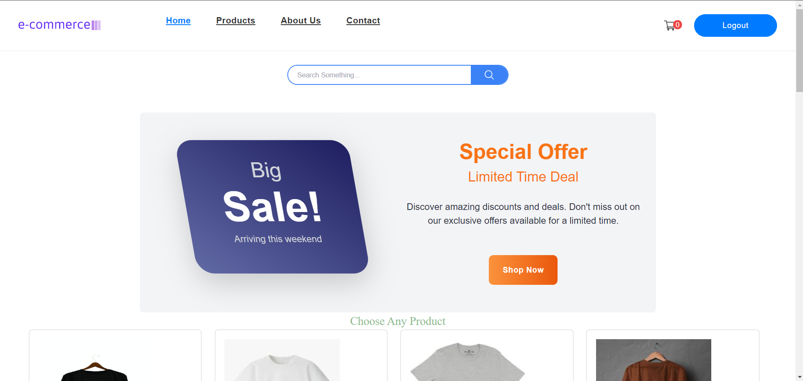
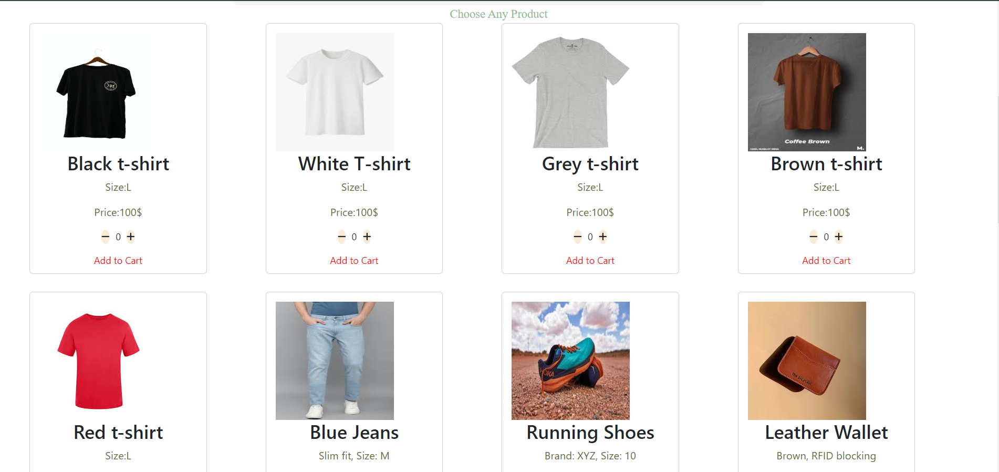
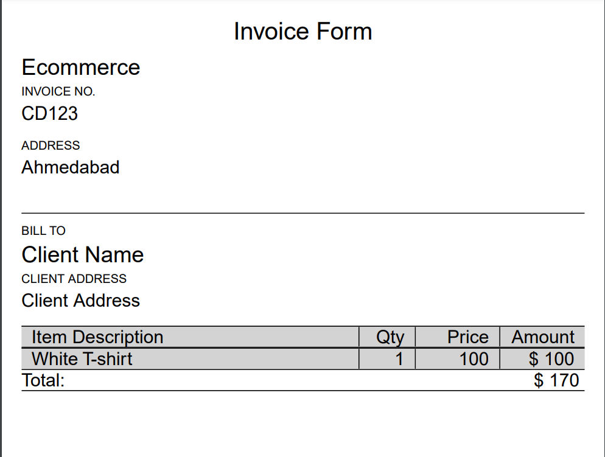
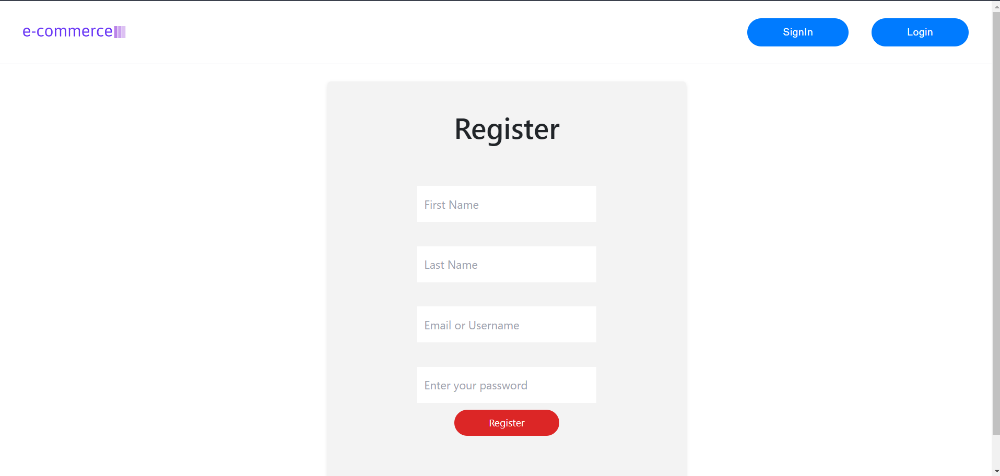
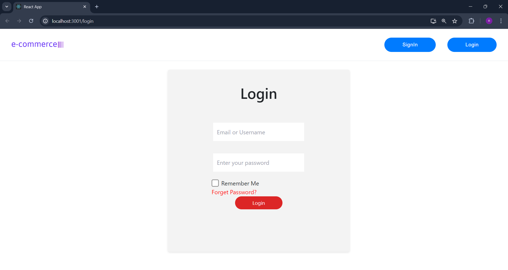

# E-commerce Website

This project is an e-commerce website developed using React for the frontend and PHP for the backend. It features product search functionality, an interactive shopping cart for adding and managing products, and an invoice printing capability to provide users with detailed purchase receipts.


## Screenshots








## Features

- Sign In
- Login
- Add to Cart
- Search Products
- Print Invoice


## Installation

Install my-project with npm

```bash
  cd path/to/your/project
  npm install
  npm start
```
    
